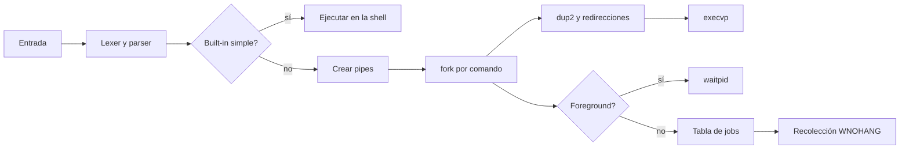

# Minishell en C

Shell Unix pequeña y portable escrita en C11. Implementa su propio lexer/parser, crea pipelines con procesos POSIX y mantiene los recursos del sistema bajo control explícito. Ya no depende de librerías binarias externas ni de una arquitectura concreta.

## Funcionalidades

- Comandos externos resueltos mediante `PATH` y `execvp`.
- Pipelines de longitud arbitraria con `|`.
- Redirecciones `<`, `>`, `>>`, `2>` y `2>>`.
- Comillas simples/dobles, escapes y expansión de `$VARIABLE`, `${VARIABLE}` y `$$`.
- Procesos en segundo plano con `&`, listado con `jobs` y recuperación con `fg [id]`.
- Built-ins `cd`, `pwd`, `umask`, `jobs`, `fg` y `exit [estado]`.
- Gestión de `SIGINT` y `SIGQUIT`: la shell permanece viva y los procesos foreground reciben el comportamiento normal.
- Recolección no bloqueante de hijos con `waitpid(..., WNOHANG)` para evitar zombies.
- Modos interactivo, por `stdin` y de una sola orden.

## Arquitectura



| Módulo | Responsabilidad |
| --- | --- |
| `parser.c` | Tokenización, comillas, expansión, validación de sintaxis y liberación del AST. |
| `executor.c` | Built-ins, pipes, `fork`, grupos de procesos, redirecciones, `execvp`, jobs y esperas. |
| `mymsh.c` | Bucle interactivo, señales y selección del modo de entrada. |

Separar parsing y ejecución permite probar la sintaxis sin crear procesos y auditar la gestión de descriptores por separado.

## Compilación

Con Make:

```bash
make
```

Con CMake:

```bash
cmake -S . -B build -DCMAKE_BUILD_TYPE=Release
cmake --build build
```

## Uso

```bash
./mymsh
./mymsh "printf 'hola\\n' | wc -l"
printf 'pwd\ncd /tmp\npwd\nexit\n' | ./mymsh
```

Ejemplos interactivos:

```console
msh> cat entrada.txt | grep error >> errores.txt
msh> sleep 10 &
[1] 42137
msh> jobs
[1] ejecutando  sleep 10 &
msh> fg 1
sleep 10 &
```

## Pruebas y análisis dinámico

```bash
make test
make sanitize
```

Las pruebas unitarias validan el parser. Las pruebas de integración comparan pipelines sencillos con Bash y cubren comillas, variables, entrada, truncado, append, errores de sintaxis y persistencia de estado entre built-ins. GitHub Actions repite la compilación y las pruebas con GCC, AddressSanitizer/UndefinedBehaviorSanitizer y Valgrind con seguimiento de descriptores.

Para revisar descriptores y memoria en Linux:

```bash
valgrind --leak-check=full --track-fds=yes ./mymsh "printf 'a\\nb\\n' | wc -l"
```

## Procesos, descriptores y seguridad

- Cada hijo hereda únicamente los descriptores necesarios; después de `dup2`, todos los extremos de pipe se cierran antes de `execvp`.
- Los ficheros redirigidos se crean con modo `0666`, limitado por la `umask` del proceso; la shell no fuerza permisos más amplios.
- Los argumentos se pasan como vector a `execvp`: no se reconstruye una orden para entregársela a otra shell, evitando una segunda interpretación inesperada.
- Los procesos de un pipeline comparten grupo de procesos, lo que prepara una gestión coherente de señales y jobs.
- Todos los hijos foreground se esperan y los background se recolectan periódicamente, evitando procesos zombie.
- La entrada tiene límite explícito y el parser usa memoria dimensionada dinámicamente.

Entender una shell resulta especialmente útil en seguridad Linux: hace visibles los límites entre procesos, el entorno heredado, la resolución de ejecutables mediante `PATH`, los permisos, las señales y el ciclo de vida de cada descriptor.

## Alcance conocido

No pretende sustituir Bash. No implementa globbing (`*.c`), heredocs, sustitución `$(...)`, operadores `&&`/`||`, alias ni job control completo con procesos detenidos y control del terminal. Los built-ins que modifican estado se ejecutan como órdenes simples, sin pipeline ni redirección.
